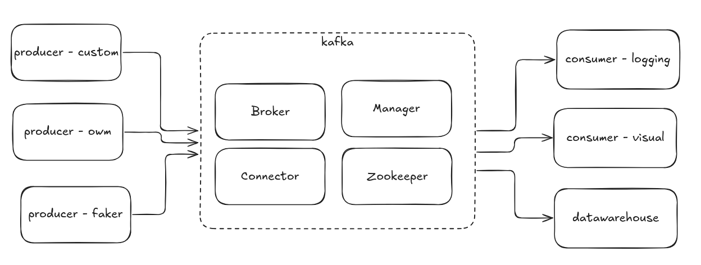

# Assignment 1 - Data Pipeline With Docker

By Dat Pham - S3927188

# Reference 

This work is based on the following Github repositories:

- https://github.com/vnyennhi/docker-kafka-cassandra-faker-api

- https://github.com/salcaino/sfucmpt733/tree/main/foobar-kafka


# Instructions



The containers will be run in the following orders

1. `datawarehouse`: A Cassandra database for storing the event stream

2. `kafka`: An event streaming service.

3. `producer`: The event sources that continously stream data in real-time.

3. `customer`: The sinks that uses event data for visualization or logging.  


## Create docker networks

```bash
$ docker network create kafka-network                         # create a new docker network for kafka cluster (zookeeper, broker, kafka-manager services, and kafka connect sink services)
$ docker network create cassandra-network                     # create a new docker network for cassandra. (kafka connect will exist on this network as well in addition to kafka-network)
```


## Running Containers

There are two ways to run the containers. You can either use traditional command, or use `run_docker.sh` script to save time.

```bash 
# traditional
$ docker compose -f warehouse/docker-compose.yml up --build -d

# make script executable first
$ chmod +x ./run_docker.sh

# faster way
$ ./run_docker.sh -name warehouse
```

The script has another mode `-auto` where all of the containers will turn up in turn with a delay of 10 seconds

```bash
# run every containers
$ ./run_docker.sh -auto
```

> Note: Although the containers are ensured in correct order, some of them are not stable, which sometimes cause some chain of crashes. Therefore it is more about convenience. 


## Warehouse

Cassandra is setup so it runs keyspace and schema creation scripts at first setup so it is ready to use.

```bash
$ docker compose -f warehouse/docker-compose.yml up --build -d

# or 
$ ./run_docker.sh -name warehouse
```

We can check if the database is working
```bash
# log in shell 
$ docker exec -it data-warehouse bash

# access db shell
$ cqlsh --cqlversion=3.4.4 127.0.0.1 
```


## Producers

The producer-side of this pipeline consists of 3 API:

- [OpenWeatherMap - Free Tier](https://openweathermap.org/api) at folder `producer-owm`

- [Python Faker API](https://faker.readthedocs.io/en/master/) at folder `producer-faker`

- [Gemini Crypto Exchange API](https://docs.gemini.com/rest-api/) at folder `producer-custom`

For OpenWeatherMap, please fill the file `producer-owm/openweathermap_service.cfg` with your API key accordingly.

```cfg
[openweathermap_api_credential]
access_token = "example_token" 
```

Start the containers using these comamnds

```bash
# openweathermap
$ docker compose -f producer-owm/docker-compose.yml up --build -d

# faker 
$ docker compose -f producer-faker/docker-compose.yml up --build -d

# custom
$ docker compose -f producer-custom/docker-compose.yml up --build -d

# or using script
$ ./run_docker.sh -name producer-owm
$ ./run_docker.sh -name producer-faker
$ ./run_docker.sh -name producer-custom
```

## Kafka
```bash
# start single zookeeper, broker, kafka-manager and kafka-connect services
$ docker compose -f kafka/docker-compose.yml up -d            

# or 
$ ./run_docker.sh -name kafka

# sanity check to make sure services are up: broker, kafka-manager, zookeeper, connect service
$ docker ps -a                                                
```

When all services are available, there are several exposed endpoints for healthcheck:

- Kafka manager front-end at port `9000` for viewing cluster and topics in Kafka.

- Kafka-connect connector sinks at port `8083`:
  - `/connectors` for list of sinks.
  - `/connectors/sink-name/status` to check if the sink is working or failed.

### Troubleshoot

* Serivce `broker` somehow crashes very often; Therefore we have to restart and wait for about 15 seconds to verify it workings. 

* Service `connector` relies on `broker` for event listening and `warehouse` for storing events. Therefore if one of them crashes, we have to restart `connector` as well. 

* If there is a load of messages like `Kafka Connect listener HTTP state:  000  (waiting for 200)`, it seems that the connector driver is not working. 

We can either resetart the connector, or manually go to CLI of the "kafka-connect" container and run the below comment to start the Cassandra sinks.

```bash
# log in container shell 
$ docker exec -it connect bash

# run connector script
./start-and-wait.sh
```

## Consumers


## Check that data is arriving to Cassandra

First login into Cassandra's container with the following command or open a new CLI from Docker Desktop if you use that.
```bash
$ docker exec -it cassandra bash
```
Once loged in, bring up cqlsh with this command and query twitterdata and weatherreport tables like this:
```bash
$ cqlsh --cqlversion=3.4.4 127.0.0.1 #make sure you use the correct cqlversion

cqlsh> use kafkapipeline; #keyspace name

cqlsh:kafkapipeline> select * from twitterdata;

cqlsh:kafkapipeline> select * from weatherreport;
```

And that's it! you should be seeing records coming in to Cassandra. Feel free to play around with it by bringing down containers and then up again to see the magic of fault tolerance!


## Visualization

Run the following command the go to http://localhost:8888 and run the visualization notebook accordingly

```
docker compose -f data-vis/docker-compose.yml up -d
```

## Teardown
You can stop and clean containers using script `clean_docker.sh`

```bash
# make script executable
$ chmod +x ./clean_docker.sh

# stop all containers
$ ./clean_docker.sh 

# stop + delete all containers
$ ./clean_docker.sh -proc

# stop + delete containers and their images
$ ./clean_docker.sh -img
```
> Note: The script can affect other containers / images. Please handle with care.

To stop all running kakfa cluster services

```bash
$ docker compose -f data-vis/docker-compose.yml down # stop visualization node

$ docker compose -f consumers/docker-compose.yml down          # stop the consumers

$ docker compose -f owm-producer/docker-compose.yml down       # stop open weather map producer

$ docker compose -f twitter-producer/docker-compose.yml down   # stop twitter producer

$ docker compose -f kafka/docker-compose.yml down              # stop zookeeper, broker, kafka-manager and kafka-connect services

$ docker compose -f cassandra/docker-compose.yml down          # stop Cassandra
```

!IMPORTANT!: These commands are for your reference, please don't do it as we don't want to spend time downloading resources again in the next tutorial.

To remove the kafka-network network:

```bash
$ docker network rm kafka-network
$ docker network rm cassandra-network
```

To remove resources in Docker

```bash
$ docker container prune # remove stopped containers, done with the docker compose down

$ docker volume prune # remove all dangling volumes (delete all data from your Kafka and Cassandra)

$ docker image prune -a # remove all images (help with rebuild images)

$ docker builder prune # remove all build cache (you have to pull data again in the next build)

$ docker system prune -a # basically remove everything
```


